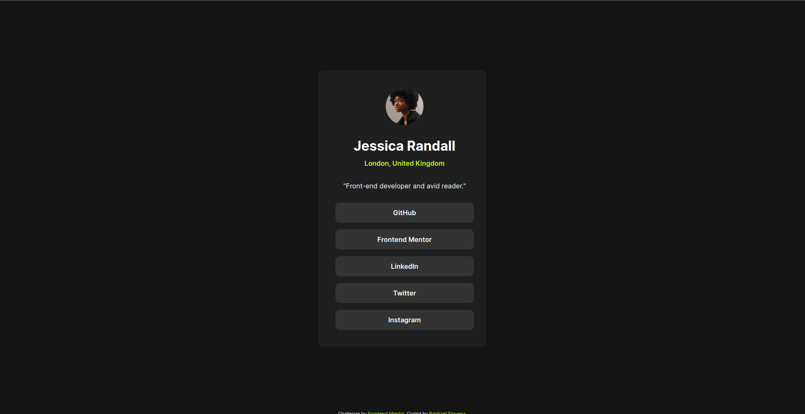

# Frontend Mentor - Solução do Perfil de Links Sociais

Esta é uma solução para o [desafio do componente de perfil de links sociais no Frontend Mentor](https://www.frontendmentor.io/challenges/social-links-profile-UG32l9m6dQ). Os desafios do Frontend Mentor ajudam você a melhorar suas habilidades de codificação construindo projetos realistas.

O projeto consiste em um componente de perfil de links sociais desenvolvido como solução para o desafio proposto pelo Frontend Mentor. O componente exibe um perfil de usuário com links para diversas redes sociais, utilizando HTML semântico e CSS personalizado para criar uma interface amigável e responsiva.

## Índice

- [Visão Geral](#visão-geral)
  - [Captura de Tela](#captura-de-tela)
  - [Links](#links)
- [Meu Processo](#meu-processo)
  - [Construído com](#construído-com)
  - [O que eu aprendi](#o-que-eu-aprendi)
  - [Desenvolvimento contínuo](#desenvolvimento-contínuo)
  - [Recursos úteis](#recursos-úteis)
- [Autor](#autor)
- [Agradecimentos](#agradecimentos)

## Visão Geral

### Captura de Tela



### Links

- URL da Solução: [Solução](https://github.com/raphaelsiqueiira/social-links-profile-main)
- URL do Site Ao Vivo: [Site ao Vivo](https://raphaelsiqueiira.github.io/social-links-profile-main/)

## Meu Processo

### Construído com

- Marcação HTML5 semântica
- Propriedades personalizadas de CSS
- Flexbox
- CSS Grid

### O que eu aprendi

Ao trabalhar neste projeto, aprendi sobre o uso eficaz de variáveis CSS para gerenciar estilos de forma mais eficiente e consistente. Isso permite que futuras atualizações no CSS possam ser feitas mais rapidamente e de forma uniforme.

```css
:root {
  --green: hsl(75, 94%, 57%);
  --white: hsl(0, 0%, 100%);
  --grey: hsl(0, 0%, 20%);
  --dark-grey: hsl(0, 0%, 12%);
  --off-black: hsl(0, 0%, 8%);
}
```

### Desenvolvimento contínuo

Em meu próximo passo de aprendizado, pretendo focar na melhoria do meu conhecimento sobre HTML semântico e na criação de estilos mais eficazes para minhas páginas.

HTML Semântico: Planejo dedicar tempo para estudar e praticar o uso de elementos HTML semânticos de forma adequada. Isso inclui entender a importância de escolher os elementos corretos para o conteúdo, para melhorar a acessibilidade, SEO e a estrutura geral do meu código.

Estilizações Avançadas: Quero aprimorar minhas habilidades de estilização CSS, buscando por técnicas mais avançadas para criar layouts responsivos, utilizando Flexbox, Grid, e outras técnicas modernas. Além disso, pretendo explorar a criação de animações e transições para tornar minhas páginas mais dinâmicas e envolventes para os usuários.

JavaScript: Reconheço a importância do JavaScript no desenvolvimento web e como ele pode adicionar interatividade e funcionalidades avançadas às minhas criações. Portanto, meu próximo passo será aprofundar meu conhecimento nessa linguagem, estudando conceitos mais avançados, como manipulação do DOM, eventos, AJAX, e frameworks modernos como React ou Vue.js.

Estou entusiasmado para embarcar nessa jornada de aprendizado e aplicar esses novos conhecimentos em meus projetos futuros, visando sempre melhorar a qualidade e a experiência do usuário em minhas criações.

### Recursos úteis

- [Recurso de aprendizado Flexbox](https://origamid.com/projetos/flexbox-guia-completo/) - Este guia me ajudou em relação aos meus conhecimentos de Flexbox.
- [Recurso de aprendizado :root](https://developer.mozilla.org/pt-BR/docs/Web/CSS/Using_CSS_custom_properties) - Este artigo me ajudou no aprendizado sobre variáveis CSS.

## Autor

- Frontend Mentor - [@raphaelsiqueiira](https://www.frontendmentor.io/profile/raphaelsiqueiira)
- X (Twitter) - [@Raphael_4z](https://x.com/Raphael_4z)
